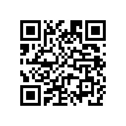

## QR Code svg generator
Pure javascript QR Code generator. Armed with elegant method for creating SVG nodes.

[QR Code svg generator](https://datalog.github.io/demo/qrcode-svg/) (Live demo)


## Easy to start
After `qrcode.min.js` is downloaded and connected to your html5 page, call:
```javascript
var
svgNode = QRCode("Hello World!");
```

All other options:
```javascript
var
svgNode = QRCode({

     msg :  "Your message here"
    ,dim :   300
    ,pad :   6
    ,mtx :   7
    ,ecl :  "H"
    ,ecb :   0
    ,pal : ["#000000", "#f2f4f8"]
    ,vrb :   1

});
```

## Options
* **msg** - QR Code ``message``, obviously, this is **mandatory parameter**.
* **dim** - is equal to needed dimention (width or height) in pixels, default value is `256`.
* **pad** - white space padding, default value is `4` blocks, set `0` for no padding.
* **mtx** - mask pattern from `0` to `7`, default value is `-1` and best suitable mask is choosen automatically
* **ecl** - error correction level: `L`, `M`, `H`, `Q`, default value is `M`.
* **ecb** - error correction level boost, default value is `1`, set `0` if no boost needed.
* **pal** - is array of [`color`,`background-color`] strings that represent hex color codes, default value is [`'#000'`] along with transparent background. Set [`'#000'`,`'#fff'`] to make background opaque.
* **vrb** - svg node is optimized to be compact and default value is `0`, set this parameter to `1` in case you need more verbose output.
